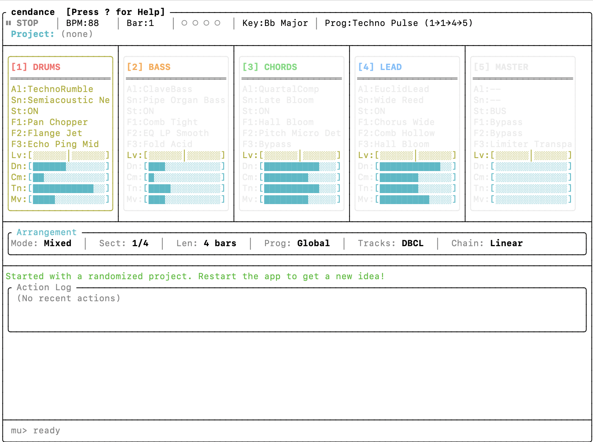

# cendance

cendance is a terminal-first generative music app with a built-in MCP server.
It uses JUCE 9.0.1 for audio/DSP and FTXUI for the keyboard-driven interface.



## Status

- macOS is the primary path today. The v0.1.2 binaries target macOS 15 and CI
  validates them on both Apple silicon and Intel. Source builds target macOS 13
  by default, but macOS 13–14 runtime compatibility is not release-validated.
- [v0.1.2](https://github.com/colinraab/cendance/releases/tag/v0.1.2) is
  available as an unsigned macOS developer preview. It is not signed with an
  Apple Developer ID or notarized, so Gatekeeper may block the first launch.
- Windows is not release-ready yet.

## Download and Run v0.1.2

Download the archive and matching `.sha256` file for your Mac from the
[v0.1.2 release](https://github.com/colinraab/cendance/releases/tag/v0.1.2).
The preview requires macOS 15. Use `arm64` for Apple silicon or `x86_64` for an
Intel Mac.

Verify the download before extracting and running it. For Apple silicon:

```bash
cd ~/Downloads
shasum -a 256 -c cendance-0.1.2-Darwin-arm64.tar.gz.sha256
tar -xzf cendance-0.1.2-Darwin-arm64.tar.gz
cd cendance-0.1.2-Darwin-arm64
./bin/cendance
```

For an Intel Mac, replace `arm64` with `x86_64` in those commands.

If macOS blocks the first launch, do not disable Gatekeeper globally. After
the checksum passes, open **System Settings > Privacy & Security**, scroll to
**Security**, select **Open Anyway** for `cendance`, and confirm. Then run
`./bin/cendance` again.

As a terminal-only alternative, remove the quarantine attribute from only the
verified executable, then run it:

```bash
xattr -d com.apple.quarantine bin/cendance
./bin/cendance
```

See [INSTALL.md](INSTALL.md) for detailed installation, Gatekeeper, and MCP
configuration instructions.

## Build From Source

```bash
git clone --recurse-submodules https://github.com/colinraab/cendance.git
cd cendance

brew install cmake ninja libsodium
cmake -B build-release -G Ninja -DCMAKE_BUILD_TYPE=Release
cmake --build build-release

./build-release/cendance_artefacts/Release/cendance
```

Run the test suite:

```bash
ctest --test-dir build-release --output-on-failure
```

Create a redistributable `.tar.gz` containing the executable and license
notices:

```bash
cmake --build build-release --target package
```

## MCP Mode

cendance includes its MCP stdio server in the main binary:

```json
{
  "mcpServers": {
    "cendance": {
      "command": "/absolute/path/to/cendance",
      "args": ["--mcp"]
    }
  }
}
```

## Experimental Sharing

cendance can sign and exchange presets, samples, algorithms, arrangements, and
projects. These features currently use a local file store by default or a
user-configured HTTP endpoint. They are not connected to Pilot Protocol or to a
cendance-operated public service. The application does not display or require a
separate terms acknowledgement. See the
[sharing architecture](docs/SHARING_ARCHITECTURE.md) before enabling a remote
endpoint.

## Useful Docs

- Install notes: [INSTALL.md](INSTALL.md)
- Build guide: [docs/BUILD.md](docs/BUILD.md)
- Codebase overview: [docs/CODEBASE_OVERVIEW.md](docs/CODEBASE_OVERVIEW.md)
- MCP and agent manual: [Resources/manual.md](Resources/manual.md)
- Experimental sharing: [docs/SHARING_ARCHITECTURE.md](docs/SHARING_ARCHITECTURE.md)
- Release and distribution status: [docs/DISTRIBUTION_NEXT_STEPS.md](docs/DISTRIBUTION_NEXT_STEPS.md)
- Contributing guide: [CONTRIBUTING.md](CONTRIBUTING.md)
- Security policy: [SECURITY.md](SECURITY.md)
- Bundled asset licensing: [Resources/LICENSE.md](Resources/LICENSE.md)
- Third-party notices: [THIRD_PARTY_NOTICES.md](THIRD_PARTY_NOTICES.md)

## License

cendance source code is licensed under the
[GNU Affero General Public License version 3](LICENSE) (`AGPL-3.0-only`). The
original drum and melodic samples are dedicated under
[CC0 1.0 Universal](Resources/LICENSE.md). Third-party components and impulse
responses retain their respective licenses; see
[THIRD_PARTY_NOTICES.md](THIRD_PARTY_NOTICES.md) and the resource notices.

## Remaining Release Work

Before inviting broad public use:

1. Enable GitHub private vulnerability reporting after the repository becomes
   public.
2. Add Apple Developer ID signing and notarization for a polished macOS
   release.
3. Complete the Windows portability checklist before advertising Windows
   support.
